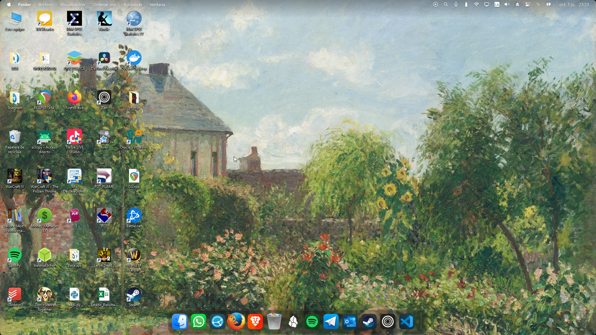
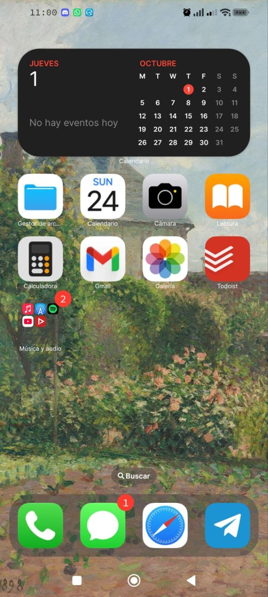

# Dotfiles

Mi configuración personal y mi entorno digital.

Parte de mi `brain`.

> Mantenlo simple. Mantenlo reproducible. Hazlo mío.

Este repositorio contiene las herramientas, configuraciones, scripts y experimentos que dan forma a mi manera de trabajar.

Evoluciona conmigo.

## Windows

Mi entorno principal de trabajo, estudio, ocio y desarrollo.

  

## Android

Mi configuración actual de pantalla de inicio y bloqueo.

  
  

## Configuraciones

Documentación y configuraciones de las herramientas que forman parte de mi entorno.

- [Obsidian](obsidian-setup.md)
- [Visual Studio Code](vscode-setup.md)
- [Software](software.md)
---

[@israelhuacce](https://github.com/israelhuacce)
